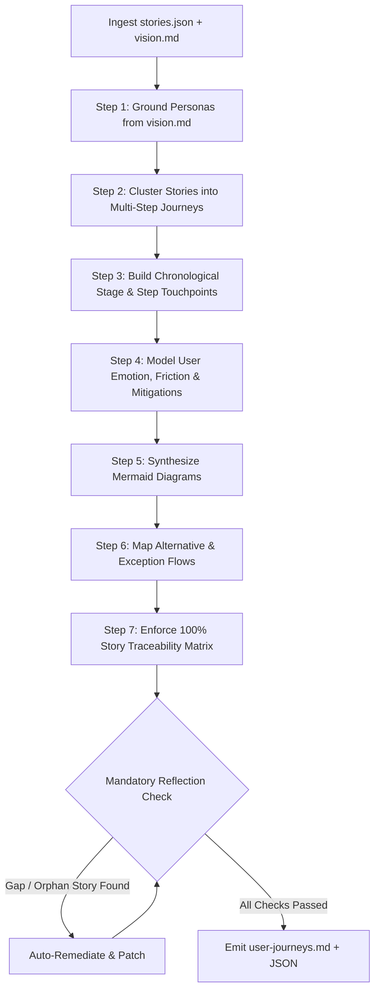

# Agent Design & Architecture Document: L1-design-user-journey-mapper

**Agent ID:** `L1-design-user-journey-mapper`  
**Layer:** `L1` (Core SDLC Pipeline)  
**Phase:** `Phase 4 — Design` (First Agent in Phase 4)  
**Owner:** Agentic AI CoE  
**Status:** Approved & Ready for Execution  

---

## 1. Executive Summary & Purpose

`L1-design-user-journey-mapper` is the foundational agent of **Phase 4 (Design)**. It bridges the gap between functional user stories (Phase 3) and screen wireframing/API design. 

```
┌───────────────────────────────┐
│     Phase 3: Inception        │
│   stories.json (Committed)    │
└──────────────┬────────────────┘
               │
               ▼
┌──────────────────────────────────────────────────────────────────────────┐
│             PHASE 4: L1-design-user-journey-mapper                       │
│                                                                          │
│  1. Extract Personas (vision.md)                                         │
│  2. Cluster Stories into End-to-End Workflows                            │
│  3. Build Step-by-Step Touchpoint Matrices                               │
│  4. Render Visual Mermaid Journey & Sequence Maps                        │
│  5. Guarantee 100% Story Traceability Matrix (qg-L1-journey-coverage)   │
└──────────────┬───────────────────────────────────────────────────────────┘
               │
       user-journeys.md
               │
       ┌───────┴───────────────────────────────┐
       ▼                                       ▼
┌──────────────────────────────┐ ┌──────────────────────────────┐
│   L1-design-ux-wireframe     │ │     L1-design-api-spec       │
│  (Screen Layouts & UI CTAs)  │ │ (REST/Event OpenAPI Schemas) │
└──────────────────────────────┘ └──────────────────────────────┘
```

### The Problem It Solves ("The Screen-in-a-Vacuum Anti-Pattern")
When software teams or AI agents move directly from individual user stories into drawing screens:
- **Disjointed User Flows:** Screens are designed in isolation without understanding the continuous path a user takes.
- **Missing Edge Cases & Exceptions:** Critical failure modes (e.g., KYC retry, connection timeouts, payment declines) are overlooked until coding or QA.
- **Ambiguous Persona Context:** It is unclear *which persona* is using *which touchpoint* at *what moment*.

### Core Value Proposition
`L1-design-user-journey-mapper` enforces the engineering discipline: **Map the complete human journey across all channels and states before designing a single UI screen.**

---

## 2. Agent Input & Output Contracts

### 2.1 Upstream Inputs

| Source | Artifact / Parameter | Purpose & Extracted Data |
| :--- | :--- | :--- |
| **`L1-inception-story-generator`** (Phase 3) | `stories.json` | Committed user stories (`story_id`, `title`, `actor`, `acceptance_criteria`, `verification_ref`). |
| **`L1-vision-statement-generator`** (Phase 0) | `vision.md` | Persona profiles, user roles, core motivations, business objectives, and pain points. |
| **Knowledge Base** | `kb-L1-sdlc-templates` | Journey map structure, formatting taxonomy, and sequence diagram templates. |

### 2.2 Downstream Outputs

| Artifact | Format | Description & Consumers |
| :--- | :--- | :--- |
| **`user-journeys.md`** | Markdown Document | Human-readable document with executive summary, persona profiles, Mermaid journey charts, step-by-step touchpoint matrices, exception flows, and 100% story traceability. |
| **Agent Output JSON** | `output_schema.json` | Structured machine-readable JSON containing `personas[]`, `journeys[]`, `stages[]`, `steps[]`, `exception_flows[]`, and `traceability_matrix[]`. |

---

## 3. How the Agent Works (Step-by-Step Execution Engine)



### Step 1: Persona Grounding
- Extracts personas defined in `vision.md`.
- Prevents hallucination by requiring all journey actors to match established personas (e.g., `PERS-01: First-Time Borrower`, `PERS-02: Repeat Business Owner`).

### Step 2: Story Clustering
- Groups discrete user stories into logical, multi-step end-to-end workflows (e.g., *Onboarding & Registration*, *Application & Customization*, *Active Account Management*).

### Step 3: Touchpoint Matrix Construction
For every discrete step in a journey, the agent populates:
1. **`step_id`**: Chronological identifier (e.g., `1.1`, `1.2`, `2.1`).
2. **`user_action`**: What the user explicitly does (e.g., "Adjusts loan slider to $2,500").
3. **`touchpoint`**: Surface/channel (e.g., "Mobile App — Slider Screen", "SMS Gateway", "Push Notification").
4. **`system_behavior`**: What the system does in response (e.g., "Dynamically recalculates EMI and APR in real-time").
5. **`emotion`**: User sentiment (e.g., *Curious*, *Anxious*, *Reassured*, *Delighted*).
6. **`friction_mitigation`**: UI/UX pattern preventing drop-off (e.g., "Display 'Zero Hidden Charges' badge").
7. **`linked_story_ids`**: The exact stories satisfied by this step (`["US-101"]`).

### Step 4: Visual Diagram Synthesis (Mermaid)
- **Mermaid Journey Chart:** Shows stages, user satisfaction scores (1 to 5), and active actors.
- **Mermaid Sequence Diagram:** Shows interaction flows across User $\leftrightarrow$ Frontend App $\leftrightarrow$ Backend BFF $\leftrightarrow$ External Services.

### Step 5: Exception & Recovery Modeling
- For every journey, at least one real-world failure mode is modeled (e.g., network disconnects, KYC verification failures, payment gateway timeouts).
- Defines graceful recovery without forcing the user to restart the entire workflow.

### Step 6: Bidirectional Traceability Enforcement
- Constructs a traceability matrix linking every input `story_id` to its corresponding `journey_id`, `step_ids`, and `verification_ref`.

---

## 4. Governance, Guardrails & Quality Gates

### 4.1 Guardrails Enforced

| Guardrail | Enforcement Rule | Action on Violation |
| :--- | :--- | :--- |
| **`gr-L1-consistency-check`** | Every story in `stories.json` must be present in `user-journeys.md`. No imaginary personas or out-of-scope features allowed. | Fails reflection loop; agent auto-patches missing mappings before emitting. |
| **`gr-L1-output-schema-validator`** | Output must strictly conform to `output_schema.json`. | Schema validation failure blocks pipeline progression. |
| **`gr-L1-pii-detection`** | Output must not contain real customer PII or credentials; use synthetic placeholders. | Sanitizes and flags offending text. |
| **`gr-L3-hallucination-detector`** | Features, systems, or APIs mentioned must derive from input context and EA standards. | Flags and removes ungrounded capabilities. |

### 4.2 Quality Gate: `qg-L1-journey-coverage`

```
┌──────────────────────────────────────────────────────────────┐
│              Quality Gate: qg-L1-journey-coverage            │
├────────────────────────────────┬─────────────────────────────┤
│ Condition                      │ Target                      │
├────────────────────────────────┼─────────────────────────────┤
│ User Story Coverage            │ 100% of input stories       │
│ Persona Grounding              │ 100% match with vision.md   │
│ Touchpoint & Mitigation Ratio  │ 100% of steps documented    │
│ Mermaid Syntax Validity        │ 100% syntax valid           │
│ Exception Path Coverage        │ ≥ 1 exception per journey   │
└────────────────────────────────┴─────────────────────────────┘
```

---

## 5. Downstream Agent Integration

### 5.1 How `L1-design-ux-wireframe` Uses `user-journeys.md`
- **Reads Touchpoints & Steps:** Converts each touchpoint step into concrete UI wireframes (screens, modals, bottom sheets).
- **Adopts Friction Mitigations:** Translates mitigation rules directly into screen components (e.g., progress bars, inline error banners, tooltip explanations).
- **Wires Navigation:** Uses the step sequence to configure CTA button targets and transitions.

### 5.2 How `L1-design-api-spec` Uses `user-journeys.md`
- **Derives Endpoints from Sequence Diagrams:** Maps system interactions in Mermaid sequence flows directly to REST endpoints, request payloads, and webhook triggers.
- **Captures Exception Response Codes:** Uses exception flows to define HTTP error responses (`400 Bad Request`, `422 Unprocessable Entity`, `504 Gateway Timeout`).

---

## 6. Mandatory Agent Reflection Checklist

Before delivering the final output, the agent runs through this internal verification:

```markdown
[REFLECTING] Verifying user journey outputs against upstream artifacts...
- [x] Are all input stories present in traceability_matrix? (100% coverage check)
- [x] Are all personas strictly derived from vision.md? (Zero hallucinated personas)
- [x] Does every step specify user action, touchpoint, system behavior, emotion, and mitigation?
- [x] Do Mermaid journey and sequence diagrams parse without syntax errors?
- [x] Are fallback/recovery paths defined for realistic edge cases?
- [x] Does the payload conform strictly to output_schema.json?
```

---

## 7. File & Repository Structure

```
agents/L1-design-user-journey-mapper/
├── DESIGN_DOCUMENT.md         # This authoritative design document
├── spec.yaml                  # Formal agent contract specification
├── README.md                  # Quick-reference overview and composition
├── output_schema.json         # Formal JSON Schema (Draft 2020-12)
└── evaluation.md              # Quality rubrics, gates, and reflection criteria

prompts/L1-design-user-journey-mapper/
└── instructions.md            # LLM prompt instructions & runtime behavioral rules

user-journeys.md               # Sample/golden output specification artifact
```
