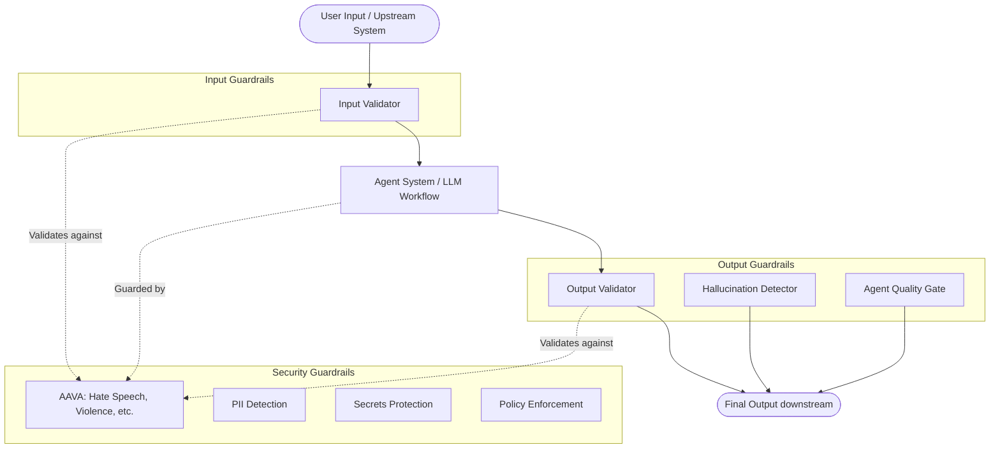
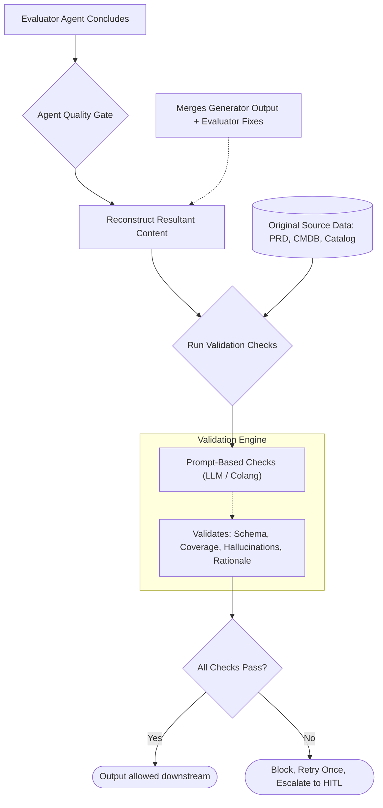

# Guardrails Implementation Requirements

This document outlines the guardrail coverage required for the system, categorized by their implementation status (Inherently Implemented, Compulsory, Optional/Recommended) and their type (Input, Output, Security, Agent Quality Gate).

---

## Architecture Overview

The following diagram illustrates where each type of guardrail sits within the request lifecycle:

---

## 1. Inherently Implemented (AAVA)

The following guardrails are already covered by AAVA's existing safety layer. No additional development or integration work is required. 

**Type:** Security Guardrails  
**Triggers on:** Input & Output

| Guardrail | Description |
|-----------|--------------|
| **Hate Speech** | Detects and blocks content containing hate speech, discriminatory language, or targeted harassment. |
| **Jailbreak** | Detects and prevents prompt injection or jailbreak attempts aimed at bypassing model safety constraints. |
| **Self Harm** | Detects and blocks content related to self-harm, suicide, or related risk indicators. |
| **Sexual** | Detects and blocks sexually explicit or inappropriate content. |
| **Violence** | Detects and blocks violent or graphic content. |

---

## 2. Compulsory Implementation

The following guardrails **must** be implemented as part of this project.

### 2.1 Input Validator (`gr-input-validator`)
- **Type:** Input Guardrail
- **Triggers on:** Input
- **Purpose:** Validates all incoming user input before it reaches the model or downstream systems.
- **Scope:** Enforces expected input formats, schema constraints, length limits, and rejects malformed or malicious input payloads.

### 2.2 Output Validator (`gr-output-validator`)
- **Type:** Output Guardrail
- **Triggers on:** Output
- **Purpose:** Validates model-generated output before returning it to the user.
- **Scope:** Ensures output matches expected schemas, formats, and does not contain broken payloads.

### 2.3 PII Detection (`gr-pii-detection`)
- **Type:** Security Guardrail
- **Triggers on:** Input & Output
- **Purpose:** Detects and flags/redacts Personally Identifiable Information (PII).
- **Scope:** Covers common PII types (names, addresses, phone numbers, email addresses, government IDs, financial information, etc.) to prevent unintended exposure or processing of sensitive personal data.

### 2.4 Secrets Protection (`gr-secrets-protection`)
- **Type:** Security Guardrail
- **Triggers on:** Input & Output
- **Purpose:** Detects and blocks secrets from being passed into or leaked out of the system.
- **Scope:** Applies to API keys, credentials, tokens, passwords, connection strings, etc.

### 2.5 Agent Quality Gates (AQG) (`gr-<agent-name>-quality-gate`)
- **Type:** Agent Quality Gate
- **Triggers on:** Output (Post-Execution / Evaluator conclusion)
- **Purpose:** Acts as a final checklist for the agent before finalizing its operation. 
- **Scope:** Use-case specific. Evaluates the agent's resultant output based on the agent's specific evaluation rubric. Enforces hallucination checks, complex output schema validation against original source data, and cross-consistency checks. (e.g., `gr-L1-impact-assessment-quality-gate`).

*(See Section 4 for an architecture deep dive into AQGs)*

---

## 3. Optional & Recommended Implementation

The following guardrails are optional or recommended enhancements based on the specific agent, task, or use case.

### 3.1 Policy Enforcement (`gr-policy-enforcement`)
- **Status:** Optional
- **Type:** Security Guardrail
- **Triggers on:** Input & Output
- **Purpose:** Enforces business/use-case-specific policies and rules.
- **Scope:** Must be tailored individually for each agent/task (e.g., permitted actions, domain-specific compliance rules). 

### 3.2 Hallucination Detector (`gr-hallucination-detector`)
- **Status:** Recommended (Note: Evaluator / Agent Quality Gate handles this primarily)
- **Type:** Output Guardrail
- **Triggers on:** Output
- **Purpose:** Detects potential hallucinations or factually unsupported claims in model-generated output.
- **Scope:** Validates output against source data/context and flags responses not grounded in verified information.

---

## 4. Agent Quality Gate (AQG) Deep Dive

Agent Quality Gates (AQG) operate differently from standard input/output guardrails because they check **domain-specific semantics and adherence to source truths**, rather than just generic safety or schema.

### What does it do?
An AQG fires on the **evaluator agent's post-execution** step. 
Instead of checking what the main generator agent initially produced, or what the evaluator's internal score was, it reconstructs the **RESULTANT** content (the generator's output + any fixes the evaluator successfully applied). It then cross-checks that final payload against the **original source data** (e.g., PRDs, CMDB exports, service catalogs).

**Why it matters:** An evaluator agent reporting "fixed and approved" is merely an LLM claim. The AQG provides an independent, hard-coded and semantic verification that the final output going downstream genuinely maps back to reality without hallucination, skipped checks, or vacuous references.

### AQG Architecture

### Core Validation Categories (Prompt-Based)
1. **Output Schema Validation:** Ensures the resultant content strictly conforms to the expected schemas, required fields, and enumerations (e.g., Blast Radius is exactly "Low", "Medium", or "High") via LLM evaluation.
2. **Anti-Hallucination & Coverage:** Checks that every reference in the output (e.g., a CI ID or Requirement ID) actually exists in the original source data provided to the agent.
3. **Rubric Adherence:** Evaluates whether rationales genuinely explain a decision rather than just restating the output, and ensures the agent hasn't silently reconciled missing data.

---

## Summary Table

| Guardrail Name | Implementation Status | Type | Triggers On |
|---|---|---|---|
| Hate Speech | Inherently Implemented (AAVA) | Security | Input & Output |
| Jailbreak | Inherently Implemented (AAVA) | Security | Input & Output |
| Self Harm | Inherently Implemented (AAVA) | Security | Input & Output |
| Sexual | Inherently Implemented (AAVA) | Security | Input & Output |
| Violence | Inherently Implemented (AAVA) | Security | Input & Output |
| Input Validator | Compulsory | Input | Input |
| Output Validator | Compulsory | Output | Output |
| PII Detection | Compulsory | Security | Input & Output |
| Secrets Protection | Compulsory | Security | Input & Output |
| Agent Quality Gates | Compulsory | Agent Quality Gate | Output |
| Policy Enforcement | Optional | Security | Input & Output |
| Hallucination Detector | Recommended | Output | Output |