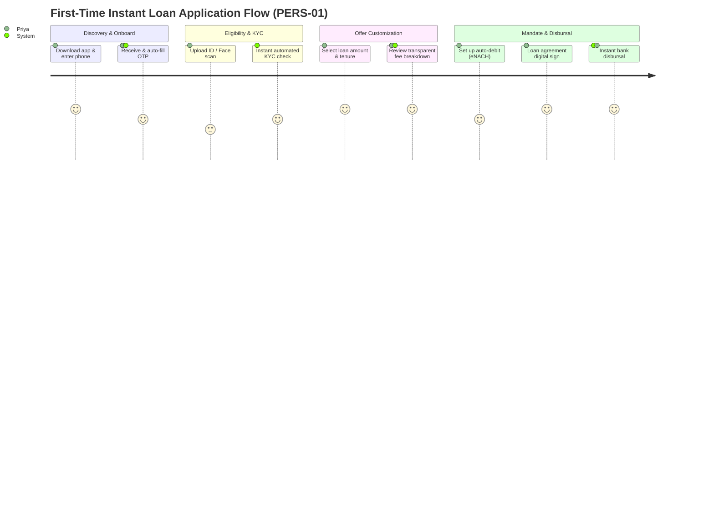
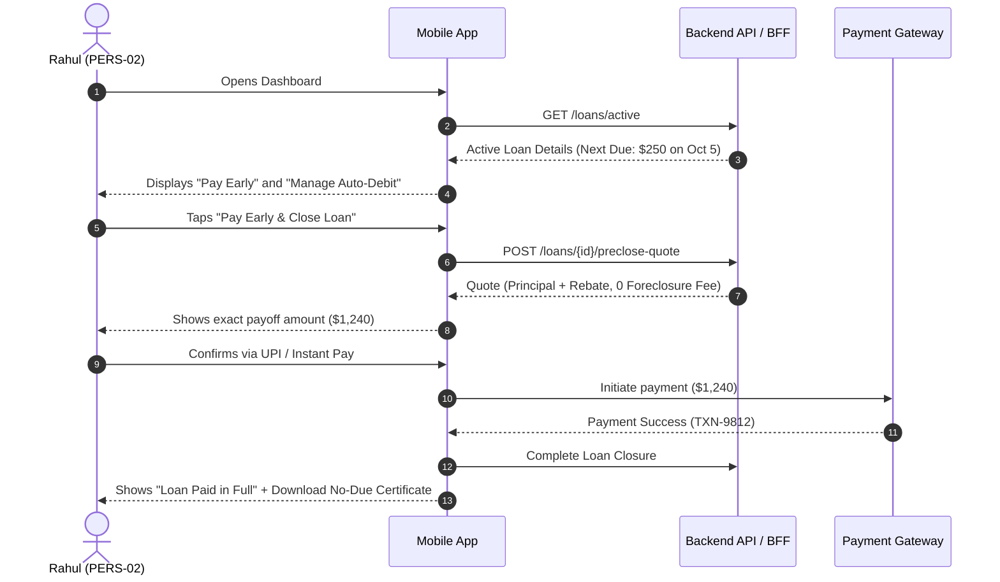

# User Journeys Specification

**Document:** `user-journeys.md`  
**Generated By:** `L1-design-user-journey-mapper`  
**Inputs:** `stories.json` (Phase 3 Stories), `vision.md` (Persona definitions)  
**Quality Gate:** `qg-L1-journey-coverage`  
**Version:** 1.0.0  

---

## 1. Executive Summary & Scope

This document establishes the end-to-end user journeys, touchpoints, system responses, and emotional states for in-scope stories. It serves as the baseline for `L1-design-ux-wireframe` and ensures no screen is designed without end-to-end user path context.

### Coverage Summary
- **Target Personas:** 2 (First-time Applicant, Repeat Borrower)
- **Mapped User Stories:** `US-101` through `US-106` (100% coverage)
- **Primary Journeys:** 2 End-to-End Happy Paths, 2 Exception/Recovery Flows

---

## 2. Persona Profiles (Grounded from `vision.md`)

| Persona ID | Name & Role | Context & Motivations | Core Pain Points |
| :--- | :--- | :--- | :--- |
| **PERS-01** | **Priya — First-time Applicant** (Salaried Professional) | Needs quick emergency credit for unexpected expenses. Values transparency, speed, and minimal data entry. | Anxious about hidden charges, intimidated by complex forms, fears credit score damage. |
| **PERS-02** | **Rahul — Repeat Borrower** (Gig Economy Worker) | Takes recurring short-term cash flow loans. Values 1-click re-application and flexible repayment dates. | Hates repeating KYC verification, needs instant disbursal confirmation. |

---

## 3. End-to-End Journey Maps

### Journey 1: First-Time Instant Loan Application & Disbursal
- **Primary Persona:** `PERS-01` (Priya)
- **Goal:** Complete registration, KYC, loan offer selection, and receive funds in under 3 minutes.
- **Stories Covered:** `US-101`, `US-102`, `US-103`, `US-104`

#### Visual Flowchart (Mermaid)

#### Step-by-Step Touchpoint Matrix

| Stage | Step # | User Action | Touchpoint / Channel | System Behavior & Feedback | Emotion | Friction Risk & Mitigation | Linked Story |
| :--- | :---: | :--- | :--- | :--- | :--- | :--- | :--- |
| **1. Onboard** | 1.1 | Enters phone number on splash screen | Mobile App (Landing) | Validates 10-digit number; sends 6-digit SMS OTP | Neutral | *Risk:* SMS delay. *Mitigation:* 30s resend timer + WhatsApp OTP option. | `US-101` |
| **1. Onboard** | 1.2 | Verifies OTP | Mobile App (OTP Modal) | Auto-reads OTP; establishes authenticated session token | Reassured | *Risk:* Wrong OTP. *Mitigation:* Inline clear error with remaining attempts counter. | `US-101` |
| **2. KYC** | 2.1 | Takes selfie & scans Government ID | Mobile App (Camera View) | Client-side glare/blur detection before API upload | Anxious | *Risk:* Blurry photo reject. *Mitigation:* Real-time camera bounding box guide. | `US-102` |
| **2. KYC** | 2.2 | Waits for verification | Mobile App (Processing State) | Async KYC verification via identity registry (<5s) | Hopeful | *Risk:* Service latency. *Mitigation:* Animated progress indicator with dynamic progress steps. | `US-102` |
| **3. Offer** | 3.1 | Adjusts loan slider ($500–$5,000) & tenure (3–12 mo) | Mobile App (Offer Calculator) | Dynamically recalculates monthly EMI, APR, and total interest in real-time | Excited / Empowered | *Risk:* Hidden fee anxiety. *Mitigation:* "Zero hidden fees" badge and expandable breakdown table. | `US-103` |
| **4. Agreement** | 4.1 | Reviews Key Fact Statement (KFS) and e-signs | Mobile App (Summary Sheet) | Renders standardized 1-page summary; captures biometric/OTP signature | Confident | *Risk:* Legal jargon overload. *Mitigation:* Plain English callouts for key terms. | `US-104` |
| **5. Disbursal** | 5.1 | Selects receiving bank account & submits | Mobile App (Success Screen) + Push Notification | Triggers instant payment rail transfer; displays live tracking ticker | Delighted | *Risk:* Banking rail delay. *Mitigation:* Real-time webhook updates + Reference ID copy button. | `US-104` |

---

### Journey 2: Automated Repayment Management & Pre-Closure
- **Primary Persona:** `PERS-02` (Rahul)
- **Goal:** View active balance, change auto-debit bank account, or execute an early payout.
- **Stories Covered:** `US-105`, `US-106`

#### Visual Sequence Flow (Mermaid)

---

## 4. Exception, Edge-Case & Recovery Flows

| Exception ID | Trigger Event | Fallback Experience & Recovery Path | Linked Story |
| :--- | :--- | :--- | :--- |
| **EX-01: KYC Failure** | ID mismatch or liveness check fails 2 times. | App gracefully switches to "Manual Review Mode". User is prompted to upload backup PDF proof with a clear promise of review within 2 business hours. | `US-102` |
| **EX-02: Network Drop during Disbursal** | Connection lost after agreement signing but before confirmation screen. | On app restart, state engine detects `PENDING_DISBURSAL` and displays a persistent status banner ("Transfer in Progress") rather than making the user restart the flow. | `US-104` |
| **EX-03: Mandate Registration Failure** | User's bank rejects eNACH / auto-debit setup. | App offers secondary payment methods (Debit Card, UPI AutoPay) or sets up manual reminder cadence without blocking loan approval. | `US-103` |

---

## 5. Traceability & Story Coverage Matrix

This matrix verifies 100% bidirectional traceability between user stories and journey stages to satisfy `gr-L1-consistency-check`.

| Story ID | Story Title | Journey Stage | Touchpoints | Verification Ref |
| :---: | :--- | :--- | :--- | :--- |
| `US-101` | Phone & OTP Authentication | Journey 1: Steps 1.1, 1.2 | Splash, OTP Modal, SMS Gateway | `VAL-AUTH-01` |
| `US-102` | Automated KYC & ID Verification | Journey 1: Steps 2.1, 2.2, EX-01 | Camera Scanner, ID Verification API | `VAL-KYC-02` |
| `US-103` | Interactive Loan Calculator & Offer | Journey 1: Step 3.1, EX-03 | Loan Slider, Offer Sheet, eNACH Gateway | `VAL-OFFER-01` |
| `US-104` | E-Sign & Instant Disbursal | Journey 1: Steps 4.1, 5.1, EX-02 | Key Fact Sheet, Payment Rails, Push | `VAL-DISB-01` |
| `US-105` | Active Loan Dashboard & Schedule | Journey 2: Steps 1, 2 | Repayment Dashboard, Notification Feed | `VAL-DASH-01` |
| `US-106` | Loan Pre-Closure & No-Due Certificate | Journey 2: Steps 3, 4, 5, 6 | Pre-close Modal, Payment Rails, PDF Generator | `VAL-CLOSE-01` |
